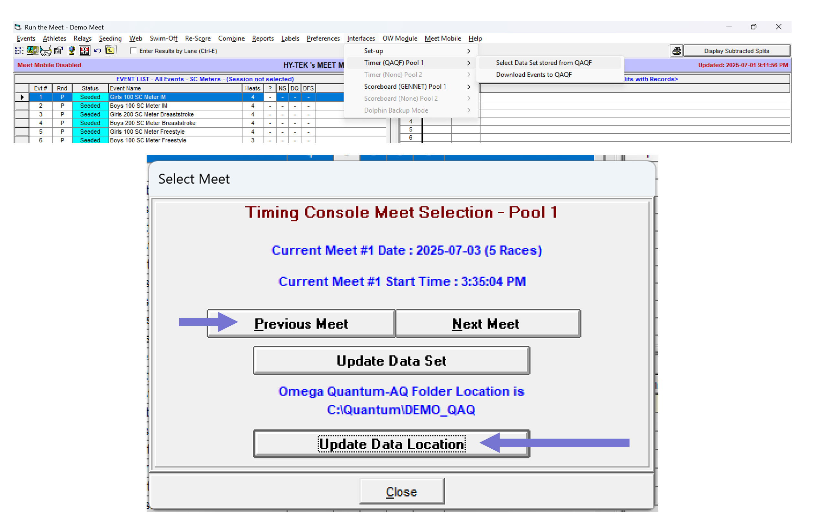
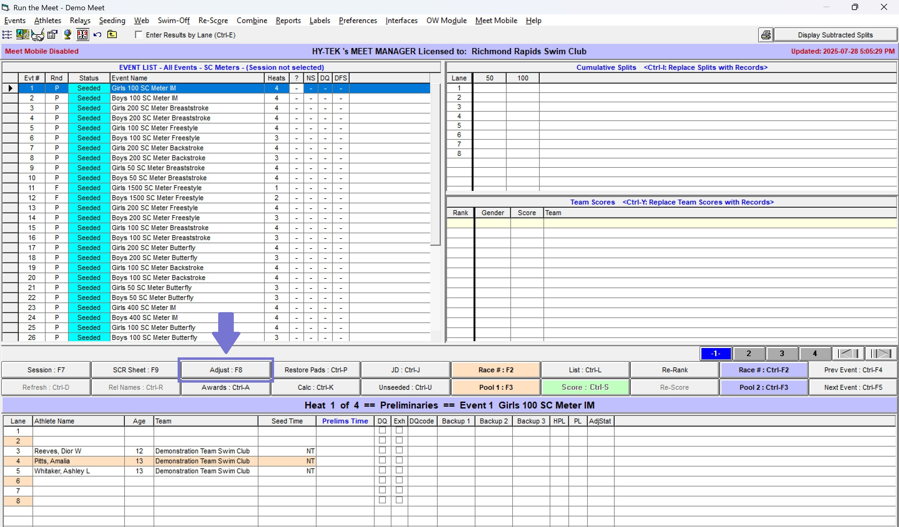
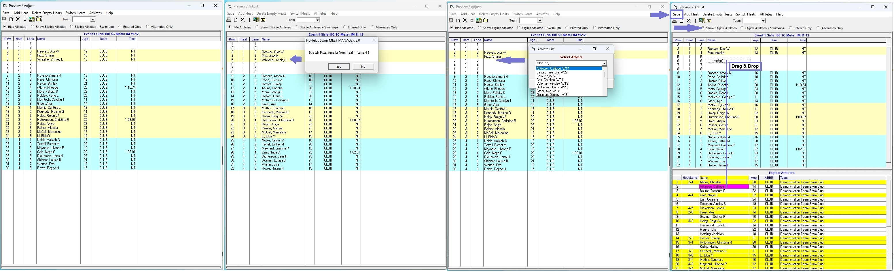

# Hy-Tek Swim Meet Manager 8: Quick Start Guide

**By Will Li | Version 0.1.0 [DRAFT IN PROGRESS] | 28 July 2025 | Access at** [**https://github.com/williamli9300/swimOfficialsToolkit**](https://github.com/williamli9300/swimOfficialsToolkit)
In Github and some viewers, you can click an image to enlarge it.

## Contents 

- **Getting Started**
  - [Setting Up Timing Interfaces](#timing)
- **Running a Meet**
  - [Pulling Times](#pullingtimes)
  - ["Adjust": Scratches & Changes (incl. Deck Entries & Name Changes)](#adjust)
  - ["Calc": Adjusting Times](#calc)
  - Processing DQs
  - Relay Names
  - Official Splits
  - Swim Offs
  - Combined Heats
- **Paperwork**
  - Results & DQ Reports
  - Session Reports
  - Score Reports
- **Other Features**
  - Web Live Results
  - Para Points
- **Common Issues**
  - No results found matching this Event and Heat for current QAQF meet selected!
  - Error when installing an update

## Getting Started

### Timing Interfaces 

*([Jump to Contents](#contents))*

**Ensure Timing Systems are set up \& named.**

1. From the Home screen, navigate to `Set-up` > `Meet Set-up`, then adjust the number of timing interfaces \& names as needed.

2. From the Run screen, navigate to `Interfaces` > `Set-up` to set up the Timing Console and Scoreboard as necessary. For meets running on Quantum, select `Omega Quantum-AQ File Sharing` as the Timing System and `Network File Sharing IST or Quantum-AQ` as the Scoreboard.

**[Quantum Specific] Select Session \& Download Events to Session**

1. From the Run screen, navigate to `Interfaces` > `Timer (QAQF) [Name]` > `Select Data Set stored from QAQF`. Click `Update Data Location` to select your Quantum data folder, and use the `Previous Meet` button to ensure that "Meet 1" is selected.

2. From the Run screen, navigate to `Interfaces` > `Timer (QAQF) [Name]` > `Download events to QAQF`.
3. If using two timing consoles, repeat steps 1 and 2 for the second timing console.
   If you are using a scoreboard with names:
4. From the Run screen, navigate to `Interfaces` > `Scoreboard (GENNET) [Name]` > `Customize`. Ensure the settings are set to the same ones as below:

5. from the Run screen, navigate to `Interfaces` > `Scoreboard (GENNET) [Name]` > `Create Start List File`.
6. If using two timing consoles, repeat step 5 for the second scoreboard.

## Running a Meet

**Always ensure that you have navigated to the correct session, by using the `Session : F7` button (or the corresponding hotkey).**

### Pulling Times 

*([Jump to Contents](#contents))*

From the Run screen, select your desired Event from the Event List, then select your desired Heat from the Heats bar.
Click the orange button labelled `[Name] : F3` or the blue button labelled `[Name] : Ctrl-F3` (or use the corresponding hotkeys) to pull times from the corresponding timing system.

*The `Run` Screen. The Event List is the window in the top left, indicating event numbers, status, and name. The Heats bar is vertically below center, aligned to the right side of the screen.*

### The `Adjust` Menu: Scratches & Changes (including Deck Entries & Name Changes) 

*([Jump to Contents](#contents))*

From the Run screen, click the `Adjust : F8` button to bring up the Adjust menu. 

The Adjust menu is organized by heat and lane. You can click "Show Eligible Athletes" or "Eligible Athletes + Swim-ups" to bring up a list of athletes at the bottom of the window. The Adjust menu is one of the few places in HyTek Meet Manager with a `Save` button. If you mess up, just click "Close" and "Don't Save", and try again!

#### Scratches

To scratch a swimmer, double-click their name to bring up the "Scratch [swimmer] from heat *X*, lane *Y*?" popup, then click "Yes".

#### Adding a Swimmer & Moving a Swimmer Around (Deck Entries & Name Changes)

##### Adding a Swimmer to an Empty Lane

Swimmers can only be added to an empty lane. You may need to remove (scratch) a swimmer in order to add a swimmer to that lane.
There are two ways to add a swimmer into an empty lane:

1. Double click an empty lane, then begin typing the swimmer's last name. Hit "Enter" on your keyboard to accept the change (sometimes clicking "OK" with your mouse will make the menu move around unexpectedly).
2. Click "Show Eligible Athletes" (or "Show Eligible Athletes + Swim-ups" if the swimmer is from a younger age group). Find the athlete's name in the bottom window (sorted by last name), then drag-and-drop the name into place.

##### Moving a Swimmer Around

There are two ways to move a swimmer around, similarly to adding a swimmer to an empty lane:

1. Double click an empty lane, then begin typing the swimmer's last name. The swimmer will be moved into the new lane.
2. Drag and drop the swimmer into the new lane. If there's already a swimmer entered into the new lane, the two swimmers will be swapped.

### The `Calc` Menu: Adjusting Times

Click the `Calc : Ctrl-K` button, or the right-most column of a 

##### Colour Coding:

| Colour                                                | Touchpad Time                                          | Backup 1                                                   | Backup 2                                                   | Colour Meaning                                                                                               |
| ----------------------------------------------------- | ------------------------------------------------------ | ---------------------------------------------------------- | ---------------------------------------------------------- | ------------------------------------------------------------------------------------------------------------ |
| Red    | 1:29.67                                                | 1:29.55                                                    | 1:29.98     | Backup Time is more than 0.30s away from Touchpad Time                                                       |
| Yellow | 1:21.56 | 1:19.20     | 1:19.17     | Average of two backups is more than 0.30s *faster* than Plunger time                                         |
| Green  | 1:35.55 | 1:35.54     | 1:10.67     | Average of two backups is more than 0.30s away from touchpad time, but one backup agrees with touchpad time. |
| Blue   | 1:21.56 | ----------- | ----------- | No backup times.                                                                                             |

