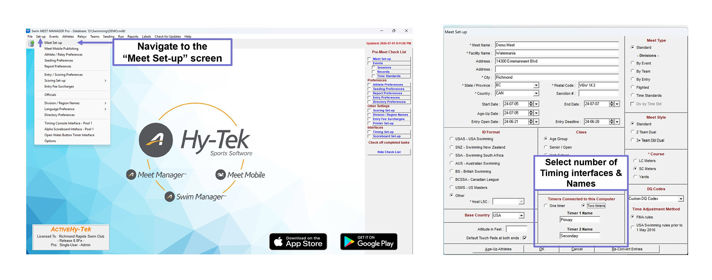

# Hy-Tek Swim Meet Manager 8: Quick Start Guide

**By Will Li | Version 0.1.0 | 28 July 2025 | Access at [https://github.com/williamli9300/swimOfficialsToolkit](https://github.com/williamli9300/swimOfficialsToolkit)**

## Contents

- [Getting Started](#gettingstarted)
  
  - [Setting Up Timing Interfaces](#timing)

- Running a Meet
  - Pulling Times
  - "Adjust": Name Changes, Scratches, Deck Entries
  - "Calc": Adjusting Times
  - Processing DQs
  - Relay Names
  - Official Splits
  - Swim Offs
  - Combined Heats

- Other Features
  - Web Live Results
  - Para Points

## Getting Started 

### Timing Interfaces 

0. **Ensure Timing Systems are set up & named.** 
   
   1. From the Home screen, navigate to `Set-up` > `Meet Set-up`, then adjust the number of timing interfaces & names as needed.
      
      
   
   2. From the Run screen, navigate to `Interfaces` > `Set-up` to set up the Timing Console and Scoreboard as necessary. For meets running on Quantum, select `Omega Quantum-AQ File Sharing` as the Timing System and `Network File Sharing IST or Quantum-AQ` as the Scoreboard.
      
      

1. Select Session & Download Events to Session
