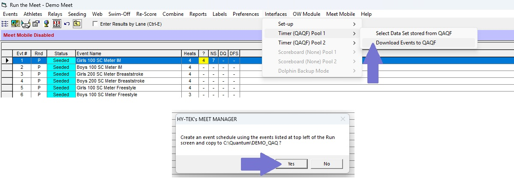
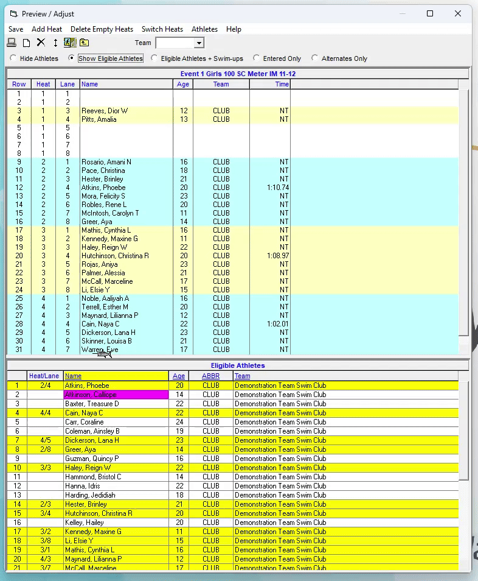
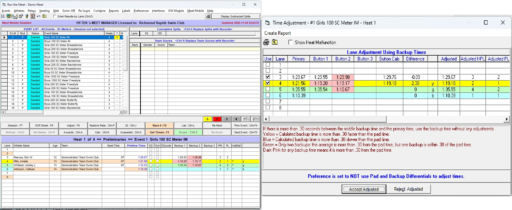

# Hy-Tek Swim Meet Manager 8: Quick Start Guide

**By Will Li | Version 0.1.0 [DRAFT IN PROGRESS] | 18 November 2025 | Access at** [**https://github.com/williamli9300/swimOfficialsToolkit/tree/v0.1.0/HyTekQuickStartGuide**](https://github.com/williamli9300/swimOfficialsToolkit/tree/v0.1.0/HyTekQuickStartGuide)

<blockquote>
  <b>&#x1f6c8; In Github and some other viewers, you can click an image below to enlarge it.</b>
</blockquote>
<br>

# Contents <a name="contents"></a>

- [**Getting Started**](#gettingstarted)
  - [Setting Up Timing Interfaces](#timing)
    - [&#127902; GIF: Pushing Event Schedule to Quantum](#gif_pushingtoqaq)
- **Running a Meet**
  - [Pulling Times](#pullingtimes)
    - [&#x1f6c8; Pulling Times from Quantum-AQ: The <code>.qaq</code> file.](#qaq_file)
  - [**Adjust**: Scratches & Changes (incl. Deck Entries & Name Changes)](#adjust)
    - [Scratches](#scratches)
    - [Moving Swimmers Around](#changes)
    - [&#127902; GIF: Drag & Drop](#gif_dragndrop)
  - [Colours & **Calc**: Adjusting Times](#calc)
  - Processing DQs
  - Relay Names
  - Official Splits
  - Swim-Offs
  - Combined Heats & Pulling by Race Number (#racenumber)
- **Paperwork**
  - Session Reports
  - Heet Sheets/Meet Program
  - Results & DQ Reports
  - Score Reports
- **Other Features**
  - Web Live Results
  - Para Points
- **Common Issues**
  - No results found matching this Event and Heat for current QAQF meet selected!
  - Error when installing an update

<br>

# Getting Started <a name="gettingstarted"></a>

## Setting Up Timing Interfaces <a name="timing"></a>

<sup>*([Jump to Contents](#contents))*</sup>

**Ensure Timing Systems and Scoreboards are set up and named.**
<details>
  <summary><i>(click to expand section)</i></summary>

1. From the Home screen, navigate to `Set-up` > `Meet Set-up`, then adjust the number of timing interfaces \& names as needed.


2. From the Run screen, navigate to `Interfaces` > `Set-up` to set up the `Timing Consoles` and `Scoreboard` as necessary, according to the pictures below. For meets running on Quantum, select `Omega Quantum-AQ File Sharing` as the Timing System and `Network File Sharing IST or Quantum-AQ` as the Scoreboard.


</details>
<br>
<b>Quantum Specific: Select Session & Download Events to Session</b>

1. From the Run screen, navigate to `Interfaces` > `Timer (QAQF) [Name]` > `Select Data Set stored from QAQF`. Click `Update Data Location` to select your Quantum data folder, and use the `Previous Meet` button to ensure that "Meet 1" is selected.


2. From the Run screen, navigate to `Interfaces` > `Timer (QAQF) [Name]` > `Download events to QAQF`.



3. If using two timing consoles, repeat steps 1 and 2 for the second timing console.

<blockquote>
&#127902; <b>GIF: Pushing Event Schedule to Quantum</b> <a name="gif_pushingtoqaq"></a>


</blockquote>

<br>

**If you are using a scoreboard with names:**
<details>
  <summary><i>(click to expand section)</i></summary>

1. From the Run screen, navigate to `Interfaces` > `Scoreboard (GENNET) [Name]` > `Customize`. Ensure the settings are set to the same ones as below:


5. from the Run screen, navigate to `Interfaces` > `Scoreboard (GENNET) [Name]` > `Create Start List File`.

6. If using two timing consoles, repeat step 5 for the second scoreboard.

**7. In order to get relay names to show up properly, you may need to use an additional tool. See [https://github.com/williamli9300/SwMM8RelayFix](https://github.com/williamli9300/SwMM8RelayFix) for more details.**

</details>
<br>

# Running a Meet

**Always ensure that you are in the correct session by using the `Session : F7` button (or the corresponding hotkey).**

<blockquote>
<details>
<summary><b>&#x1f6c8; Pulling Times from Quantum-AQ: The <code>.qaq</code> file.</b> <i>(click to expand)</i></summary><a name="qaq_file"></a>
Each time a race is completed and saved in the Quantum-AQ, it creates a result file in the shared data folder. This file has the extension <code>.qaq</code>, and the following file name format:

<br>

> `DDD-EEE-HHXRRRR.qaq`, e.g., `001-001-01F0001.qaq`

- The first 3 characters of the file name (`DDD`) are numbers from 001 to 999. These characters define the Data Set number. For most meets you will work, you will only use Data Set 001.
- The next 3 characters of the file name (`EEE`) are numbers from 001 to 999. These characters represent the Event Number of the race.
- The next 2 characters of the file name (`HH`) are numbers from 01 to 99. These characters represent the Heat Number of the race.
- The next 1 character of the file name (`X`) is a letter (e.g. T, P, S, F) representing the type of race that is swum, e.g. Timed Finals, Prelims, Semifinals, Finals).
- The last 4 characters of the file name (`RRRR`)  are numbers from 0001 to 9999. These characters represent the Race Number, and can be used to manually pull the file to any heat using the Race Number button.

Each `.qaq` file is actually a Semicolon-Separated Values file. Here's an example of what that might look like for an individual event:
```
101;1;4;F;100;QuantumAQ;6.1.21.0
0; ;     ;     ;      ;      ;      ;      ; ;    ;
0; ;     ;     ;      ;      ;      ;      ; ;    ;
0; ;     ;     ;      ;      ;      ;      ; ;    ;
1; ;34.54;71.86;111.78;145.96;145.90;145.80; ;0.66;
2; ;33.86;73.78;110.84;146.09;146.11;145.99; ;0.51;
0; ;     ;     ;      ;      ;      ;      ; ;    ;
0; ;     ;     ;      ;      ;      ;      ; ;    ;
0; ;     ;     ;      ;      ;      ;      ; ;    ;
```
- The first line contains the `Event`, `Heat`, and `Number of Touches` (`N`) values, followed by `Race Type` (equivalent to `X` above), and some information about the Quantum version that the file was created by.
- The next `n` lines correspond to the `n` lanes in the pool: typically either `1-6`, `1-8`, or `0-9`.
  - The first column of each line corresponds to the `Rank` of the lane (i.e., what place the swimmer came in the heat)
  - The second column is empty.
  - The next `N` columns correspond with the **cumulative split time**, in seconds, at the `N`th touch. Since this is a 200m event, we are expecting 4 touches: the times thus correspond to the 50m, 100m, 150m, and 200m split times, in seconds.
  - The next 3 columns correspond with Backups 1, 2, and 3, as recorded by Quantum. Here, we only have two plungers in each lane, so the third column is empty.
  - The last column contains the reaction time of the swimmer off the start.

</details>
</blockquote>

## Pulling Times <a name="pullingtimes"></a>
<sup>*([Jump to Contents](#contents))*</sup>

From the Run screen, select your desired Event from the Events list, then select your desired Heat from the Heats bar.
Click the orange button labelled `[Name] : F3` or the blue button labelled `[Name] : Ctrl-F3` (or use the corresponding hotkeys) to pull times from the corresponding timing system. (Note: the directory each button pulls times from is set up in the [Setting Up Timing Interfaces](#timing) section.)


*The `Run` Screen. The Event List is the window in the top left, indicating event numbers, status, and name. The Heats bar is vertically below center, aligned to the right side of the screen.*

Alternatively, if you know the Race Number, you can click the corresponding orange `Race # : F2` or blue `Race # : Ctrl+F2` buttons, then enter the race number, to pull the times in the `.qaq` file with the corresponding race number, into the currently selected heat. (*See [Combined Heats](#racenumber) or [About <code>.qaq</code> Files](#qaq_file) for more information.*)


## The `Adjust` Menu: Scratches & Changes (including Deck Entries & Name Changes) <a name="adjust"></a>

<sup>*([Jump to Contents](#contents))*</sup>

From the Run screen, click the `Adjust : F8` button to bring up the Adjust menu. 


The Adjust menu is organized by heat and lane. You can click "Show Eligible Athletes" or "Eligible Athletes + Swim-ups" to bring up a list of athletes at the bottom of the window. The Adjust menu is one of the few places in HyTek Meet Manager with a `Save` button. If you mess up, just click "Close" and "Don't Save", and try again!


<br>

<br>

### Scratches <a name="scratches"></a>

To scratch a swimmer, double-click their name to bring up the "Scratch [swimmer] from heat *X*, lane *Y*?" popup, then click "Yes".

### Adding a Swimmer & Moving a Swimmer Around (Deck Entries & Name Changes) <a name="adding_moving"></a>

**Adding a Swimmer to an Empty Lane**

Swimmers can only be added to an empty lane. You may need to remove (scratch) a swimmer in order to add a swimmer to that lane.
There are two ways to add a swimmer into an empty lane:

1. Double click an empty lane, then begin typing the swimmer's last name. Hit "Enter" on your keyboard to accept the change (sometimes clicking "OK" with your mouse will make the menu move around unexpectedly).
2. Click "Show Eligible Athletes" (or "Show Eligible Athletes + Swim-ups" if the swimmer is from a younger age group). Find the athlete's name in the bottom window (sorted by last name), then drag-and-drop the name into place.

**Moving a Swimmer Around**

There are two ways to move a swimmer around, similarly to adding a swimmer to an empty lane:

1. Double click an empty lane, then begin typing the swimmer's last name. The swimmer will be moved into the new lane.
2. Drag and drop the swimmer into the new lane. If there's already a swimmer entered into the new lane, the two swimmers will be swapped.

<blockquote>
&#127902; <b>GIF: Drag-And-Drop in the Adjust Menu</b> <a name="gif_dragndrop"></a>


</blockquote>

## Lane Colours & The `Calc` Menu: Adjusting Times <a name="calc"></a>



To open the `Calc` menu, click the `Calc : Ctrl-K` button, or click the right-most column of the lane viewer on the bottom part of the window.

**A Few Quick Definitions About Times & Backups**
<details>
  <summary><i>(click to expand section)</i></summary>

- **Prelims Time**/**Finals Time** is the final time assigned to the swimmer, and can be changed by using the `Calc` menu, or by overwriting the number manually.. By default, this is the Primary Time from the timing system (i.e., the touchpad time, or a Calculated Backup time determined by the timing system.)

- **Backup 1**, **Backup 2**, and **Backup 3** correspond to the the backups recorded by the timing system. 

- **Calculated Backup** is the backup, the arithmetic mean of two backups, or the median of three backups, if there are one, two, or three backup times available.
  
  </details>
<br>
<blockquote>
  <b>&#x1f6c8; Notes on Backups</b>

- Never take the average of two different kinds of sources (e.g. never average a plunger time with a stopwatch time). Go in descending order based on availability and reliability: automatic (touchpad), semi-automatic (plunger), manual (stopwatch).
- Ensure that two backup times agree with each other before taking the average. Always check your numbers to make sure they make sense with respect to the event (e.g. no 12-second 100 FR's) and the order of finish.
  
</blockquote>

In our example above, we can see three colours:

- Lane 3 appears white, with Button 2 highlighted in RED. This means that Button 2 is ≥0.30s different from the Primary time.
- Lane 4 appears YELLOW. This means the Calculated Backup is ≥0.30s faster than the Primary time. Here, it is likely that there was a touchpad malfunction, and **we decide to fall back onto the backup times.**
- Lane 5 appears GREEN. This means the calculated backup is ≥0.30s different from the Primary time, __but one backup agrees with the touchpad time.__ It is likely that one Timer pushed a plunger early, and **we decide to stay with the touchpad time.**
- Lane 6 appears BLUE. This means we have a Touchpad time but no backups. Unless the touch was judged to be good by a CJE, we would need more information.

When we go into the `Calc`  menu, we see the Primary time, the Button (i.e. Backup) times, Button Calc (i.e. Calculated Backup) time, and Difference. We also see an "Adjusted" column:

- If the row is white (Calculated Average is ≤0.30s different from Primary Time), the Adjusted time will be the same as the Primary Time, regardless of if "Use" is checked.
- If the row is YELLOW, the Adjusted time will be the Calculated Backup if "Use" is **checked** (default), or will fall back to the Primary time if "Use" is unchecked.
- If the row is GREEN, the Adjusted time will be the Primary Time if "Use" is ***un*checked** (default), or will be the Calculated Backup if "Use" is checked.
- If the row is BLUE (no backups), the Adjusted time will be the same as the Primary Time, regardless of if "Use" is checked.

Check and uncheck the "Use" rows as desired. Verify that backup times agree and make sense. When you click "Accept Adjusted", whatever is in the Adjusted column will be assigned to the Prelims Time/Finals Time field.

**Colour Coding for Lanes & Backups**
<details>
<summary><i>(click to expand section)</i></summary>

| Colour                        | Touchpad Time | Backup 1                              | Backup 2                              | Colour Meaning                                                                                           | Likely Explanation                                                                                                                                                                                                                               |
| ----------------------------- | ------------- | ------------------------------------- | ------------------------------------- | -------------------------------------------------------------------------------------------------------- | ------------------------------------------------------------------------------------------------------------------------------------------------------------------------------------------------------------------------------------------------ |
| Red&nbsp;&#x1f7e5;            | 1:29.67       | 1:29.55                               | 1:29.98&nbsp;&#x1f7e5;                | Backup Time is more than 0.30s away from Touchpad Time                                                   | If only 1 red: one plunger was off, Pad and other plunger were OK. <br> If 2 red: two plungers were very different, and "Pad" time was actually average of two plungers. Need to find a third backup time to decide what time to assign swimmer. |
| Yellow&nbsp;(y)&nbsp;&#x1f7e8;     | 1:21.56       | 1:19.20&nbsp;&#x1f7e5;&nbsp;&#x1f7e8; | 1:19.17&nbsp;&#x1f7e5;&nbsp;&#x1f7e8; | Average of backups is more than 0.30s *faster* than Touchpad time                                        | "Soft Touch": plungers are OK, Touchpad time was late.                                                                                                                                                                                           |
| Green&nbsp;(g)&nbsp;&#x1f7e9; | 1:35.55       | &#x1f7e9;&nbsp;1:35.54&nbsp;&#x1f7e9; | 1:10.67&nbsp;&#x1f7e5;&nbsp;&#x1f7e9; | Average of backups is more than 0.30s away from touchpad time, but one backup agrees with touchpad time. | One Plunger went early or late, Pad and other plunger were OK.                                                                                                                                                                                   |
| Blue&nbsp;(b)&nbsp;&#x1f7e6;  | 1:21.56       | &#x1f7e6;----&#x1f7e6;                | &#x1f7e6;----&#x1f7e6;                | Average of backups is more than 0.30s *slower* than Touchpad time                                        | Either: 1) someone stepped on the touchpad before the swimmer touched the wall; <b> 2) both Timekeepers fell asleep and forgot to hit the Plungers until it was too late; or, <br> 3) No backup times were recorded.                             |
</details>