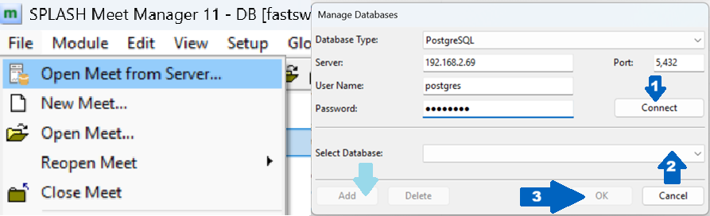
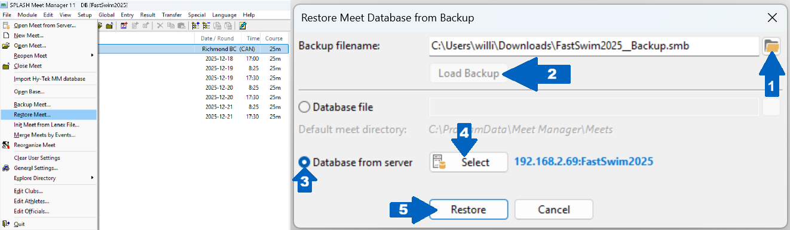

# Splash Meet Manager 11: Quick Reference Guide

**By Will Li | Version 0.0.0 [DRAFT] | 28 January 2026 | Access at** [**https://github.com/williamli9300/swimOfficialsToolkit/tree/v0.1.0/SplashQuickReferenceGuide**](https://github.com/williamli9300/swimOfficialsToolkit/tree/v0.1.0/SplashQuickReferenceGuide)

This guide is meant as a quick reference guide for the software operation of Splash Meet Manager 11. This guide is not a replacement for the thorough knowledge of the rules and roles of the Recorder and Chief Recorder.

<blockquote>
  <b>&#x1f6c8; In Github and some other viewers, you can click an image below to enlarge it.</b>
</blockquote>
<br>

----
# Contents <a name="contents"></a>
<details>
<summary><b><i>Click to expand the Table of Contents.</i></b></summary>
<br>

- [**Getting Started**](#gettingstarted)
  - [Introduction to Splash Meet Manager](#splash-intro)
    - [Modules](#Modules)
  - [Setting Up Timing Interfaces](#timing)
    - [&#127902; GIF: Pushing Event Schedule to Quantum](#gif_pushingtoqaq)
- [**Running a Meet: The `ev entries` and `rs results` Modules**](#running-a-meet)
  - [Pulling Times](#pullingtimes)
  - [**Adjust**: Widthdrawals & Changes (incl. Deck Entries & Name Changes)](#adjust)
    - [Withdrawals](#wdr)
    - [Adding & Moving Swimmers](#changes)
  - [Colours & **Calc**: Adjusting Times](#calc)
  - Processing DQs
  - Relay Names
  - Official Splits
  - Swim-Offs
- **Paperwork**
  - Session Reports
  - Heet Sheets/Meet Program
  - Results & DQ Reports
  - Score Reports
- **Other Features**
  - Web Live Results
  - Para Points
- **Common Issues**
  - No results found matching this Event and Heat for current QAQF meet selected!
  - Error when installing an update
- **Creating a Meet From Scratch**
</details>
<br>

----
# Introduction to Splash
## Modules

###  Events

###  Records

###  Clubs

###  Entries

###  Results

## Server Management

The most "basic" way to use Splash is using a Microsoft Access database (`*.mdb`) file, the same time of database that Hy-Tek Swim Meet Manager runs on. When only one person is making changes (e.g. creating the meet, pre-meet entries, etc.), this mostly fine. **However, when multiple people are connected to the same database** (e.g., at a meet with at least one Recorder computer *and* one Admin Desk computer), this can cause risks

**If you must use an Access (`*.mdb`) Database:**
- If you are <u>not</u> pulling results, <b>always  <u>Reload from Database</u></b> before performing any action (<i>especially if doing anything on the</i>  Entries <i>module, such as</i> "No advance to next round"<i>.</i>

<blockquote>
<b>&#9888; IMPORTANT: Always  <u>Reload from Database</u> before performing any action.</b><br>
</blockquote>

### Setting Up a PostgreSQL Server (Recommended)

### Setting Up a MySQL/MariaDB Server

Splash requires **case-insensitive table names** when using a MySQL/MariaDB server. This must be configured when you initialize your server, and <u>*cannot* be changed without re-initializing or re-installing your data directory</u>. MySQL/MariaDB servers default to case-insensitive tables on Windows but <i>not</i> Linux.
- Ensure the `lower_case_table_names` parameter is set to `1`:
    - In the `[mysqld]` section of your configuration file (`my.cnf` or `my.ini`, see below), ensure the parameter `lower_case_table_names = 1` is present.
    - <details><summary>If you are running MySQL/MariaDB using default configurations, you may need to create a configuration file. (<i>click to expand</i>):</summary><ul><li><b>Linux:</b> <code>my.cnf</code> can typically be found in <code>/etc/</code> or <code>/etc/mysql/</code>.</li><li><b>Windows:</b> <code>my.ini</code> can typically be found in <code>C:\Program Data\MySQL\MySQL Server X.x\</code></li><li>If there is no configuration file, create a new file called <code>my.cnf</code> (Linux) or <code>my.inf</code> (Windows) in one of the above directories, and add the following text to your file:<br><br><pre><code>[mysqlid]<br>lower_case_table_names = 1</code></pre></li></ul>
    </details>
- <details><summary>If not already configured during setup, you may need to enable access to your server from external local IP addresses using the <code>bind-addresses</code> parameter in your configuration file (see above) (<i>click to expand</i>):</summary><ul><li>If your configuration file already exists, you may need to find the line containing <code>bind-addresses = 127.0.0.1</code> and change (or add to) the IP address value, as below.</li><li>If you don't know the IP addresses your client (e.g. Admin Desk, Recorder) computers will be on, add <code>bind-address = 0.0.0.0</code> to your configuration file.</li><li>If you <i>do</i> know your IP addresses, you can add IP addresses one by one, for example: <br><br><pre><code>[mysqlid]<br>lower_case_table_names = 1<br>bind-address = 192.168.1.101,192.168.1.102,192.168.1.103,127.0.0.1</code></pre>This is <i>not</i> recommended unless you are certain that you will not be connecting additional/alternate devices to your server/database (e.g. backup computers), or are highly sensitive to unknown traffic querying your server.</li></ul></details>
- You can set the port using the `port = <port>` parameter. The default port for MySQL/MariaDB is `3306`

### Connecting to a Server

**If it your first time connecting to a new server, or if you want to test if your server is online** (prior to testing login), you can query the server and port status using the following Windows Powershell command:

```ps
Test-NetConnection -ComputerName <server_address> -Port <port>
```

<br>

**To create or open a meet from a server:** <a name="create_on_server"></a>

<br>
<span align="center">

</span>
<br>

- Navigate to `File` > `Open Meet From Server...`
- (1) Select your **Database Type**,  enter your **Server Address**, **Port**, **Username**, and **Password**, then click `Connect`.
- (2) Select your **Database** from the Dropdown menu. If you have not created a meet on your server yet, click `Add`, then enter a meet name.
- (3) Click `OK` to close.

**To restore a backup to a meet on a server:**

<br>
<span align="center">

</span>
<br>

- Navigate to `File` > `Restore Meet...`
- (1) Select your **Backup file** (`*.smb` file).
- (2) Click `Load Backup`.
- (3) Select `Database from Server`.
- (4) Click `Select` to select your server.
- When the pop-up appears, select your meet as described [above](#create_on_server).
  - Enter your **Server Address**, **Port**, **Username**, and **Password**.
  - Click `Connect`, then select your **Database** from the Dropdown menu.
  - Click `OK` to close.
- (5) Click `Restore` to restore your backup.


## Setting Up Timing Systems

# Running a Meet
## Pulling Times
- Primary & Secondary Quantum

## Processing DQs

## Making Changes: The `en` Entries Module
### Withdrawals (Scratches)
### Moving People Around
### Deck Entries

## Official Splits: The `ev` Events & `en` Entries Modules

## Swim-Offs

## Relay Names


# Pre-Meet Setup
